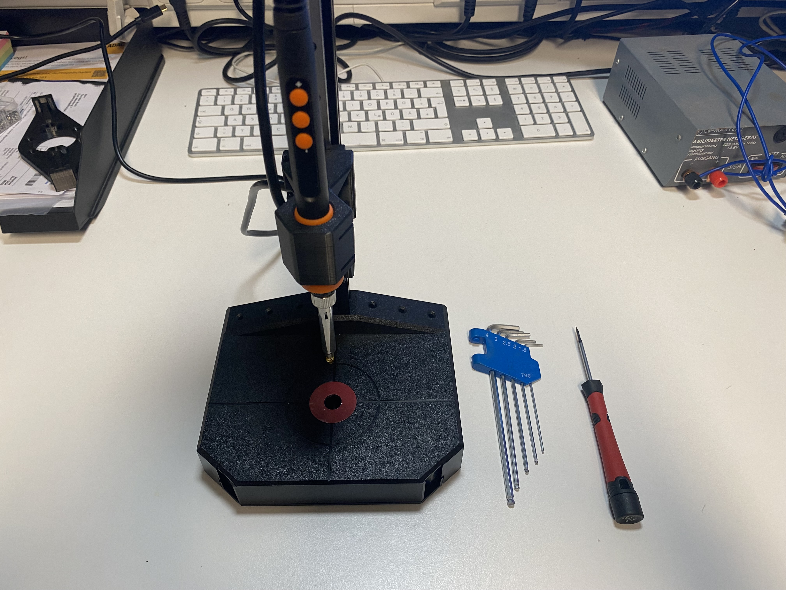

# Servo Gripper Assembly Guide

> Detaillierte Montageanleitung für den Servo Gripper.
>
> Detailed assembly manual for the servo gripper.

---

## Sprache / Language

- Deutsch: [Zur deutschen Anleitung springen](#de-start)
- English: [Jump to English guide](#en-start)

---

# Deutsch

[Zur Sprachauswahl](#language-selection)

## Inhaltsverzeichnis

- [Quick Facts](#de-quick-facts)
- [Benötigte Teile](#de-parts)
- [Werkzeuge](#de-tools)
- [Sicherheitshinweise](#de-safety)
- [Montage-Schritte](#de-steps)
- [Prüfung nach Montage](#de-check)
- [Troubleshooting](#de-troubleshooting)
- [Versionierung und Changelog](#de-versioning)
- [Mitwirken](#de-contributing)
- [Lizenz](#de-license)

---

## Quick Facts

| Thema | Details |
|---|---|
| Projekt | Servo Gripper |
| Schwierigkeit | Mittel |
| Zeitbedarf | ca. 30 min |
| Version der Anleitung | v1.0 |
| Letztes Update | 2026-05-30 |

---

## Benötigte Teile

### 3D-Druck-Teile

- [ ] Grundplatte - Menge 1
- [ ] Motorgehäuse - Menge 1
- [ ] Motorgehäuse-Deckel - Menge 1
- [ ] Drehkranz - Menge 1
- [ ] Schwingen / Arme - Menge 2
- [ ] Greiferfinger - Menge 2
- [ ] Linearführung MGN7H 150 mm - Menge 1
- [ ] Führungswagen für MGN7H - Menge 2

### Elektronik

- [ ] Waveshare ST3215 Servo Motor - Menge 1
- [ ] Waveshare Serial Servo Driver - Menge 1

### Kleinteile

- [ ] M2 x 8 mm Zylinderkopfschrauben - Menge 8
- [ ] M2 x 20 mm Linsenkopfschrauben (Flat Head) - Menge 6
- [ ] M3 x 25 mm Senkkopfschrauben - Menge 4
- [ ] M3 Gewindeeinsätze (Einschmelzmutter) - Menge 6
- [ ] M3 Passschrauben (D1=4 mm, L1=6 mm, L2=4 mm) - Menge 4
- [ ] M4 x 6 mm Madenschrauben - Menge 5
- [ ] M4 x 12 mm Senkkopfschrauben - Menge 6
- [ ] M4 Muttern - Menge 4
- [ ] M4 Gewindeeinsätze (Einschmelzmutter) - Menge 2
- [ ] Servo-Zubehör-Set (Lieferumfang ST3215) - Menge 1

---

## Werkzeuge

- [ ] Innensechskantschlüssel 1.5 bis 4 mm
- [ ] Schraubendreher PH / Schlitz fein (z. B. 4 x 2.0)
- [ ] Schraubensicherung mittelfest (optional)
- [ ] Sekundenkleber (optional)
- [ ] Lötkolben oder Einschmelzhilfe für Gewindeeinsätze

---

## Sicherheitshinweise

- Vor der Montage alle Stützstrukturen von den 3D-Druck-Teilen entfernen.
- Keine Gewalt anwenden: Bei Widerstand Ausrichtung und Passung prüfen.
- Elektrische Komponenten erst nach der mechanischen Montage bestromen.
- Bewegliche Bereiche auf Quetschstellen kontrollieren.
- Vorsicht beim Einschmelzen von Gewindeeinsätzen: Verbrennungsgefahr.

---

## Montage-Schritte

### Schritt 01

Beschreibung: M4 Gewinde-Einsätze in Motorgehäuse einschmelzen.

Wichtige Hinweise:
- Darauf achten dass, die Gewinde bündig mit der Oberfläche abschließen.

### Schritt 02

Beschreibung: M3 Gewinde-Einsätze in Motorgehäuse einschmelzen.

Wichtige Hinweise:
- Darauf achten dass, die Gewinde bündig mit der Oberfläche abschließen.
- Darauf achten dass, die Wand nicht ausbricht (dünne Wandstärke).

### Schritt 03

Beschreibung: M4 Muttern in Motorgehäuse einlegen und ggf. mit Sekundenkleber fixieren.

Wichtige Hinweise:
- Bei Verwendung von Sekundekleber, darauf achten, dass die Gewinde nicht verklebt werden.

### Schritt 04

Beschreibung: M4x12 Senkkopf Schrauben in die Grundplatte einlegen.

Wichtige Hinweise:
- Falls die Schrauben schwergängig in die Bohrungen rein gehen, dann mit einem Bohrer (4.0 - 4.5) die Bohrung etwas aufweiten.

### Schritt 05

Beschreibung: Motorgehäuse mit Grundplatte verschrauben.

Wichtige Hinweise:
- Darauf achten, dass die Gewinde leichtgängig greifen - nicht schief eindrehen.

### Schritt 06

Beschreibung: Die fertig verschraubte Baugruppe sollte nun so aussehen.

Wichtige Hinweise:
- Es sollte kein Spalt zwischen den Bauteilen sein - falls doch, dann sind die Schmelz-Einsätze vermutlich nicht tief genug eingeschmolzen.

### Schritt 07

Beschreibung: M4 Muttern in Motorgehäuse einlegen und ggf. mit Sekundenkleber fixieren.

Wichtige Hinweise:
- Bei Verwendung von Sekundekleber, darauf achten, dass die Gewinde nicht verklebt werden.

### Schritt 08

Beschreibung: M4 Muttern in Motorgehäuse einlegen und ggf. mit Sekundenkleber fixieren.

Wichtige Hinweise:
- Bei Verwendung von Sekundekleber, darauf achten, dass die Gewinde nicht verklebt werden.

### Schritt 09

Beschreibung: Servo Motor in der Motorgehäuse einlegen.

Wichtige Hinweise:
- Darauf achten, dass der Zahnkranz nach oben zur Öffnung in der Grundplatte zeigt.

### Schritt 10

Beschreibung: Motor komplett einschieben.

Wichtige Hinweise:
- Darauf achten, dass der Motor bis Anschlag in das Gehäuse eingebracht ist.

### Schritt 11

Beschreibung: M4x6 Madenschrauben eindrehen und Motor festklemmen.

Wichtige Hinweise:
- Motor mittig ausrichten.
- Darauf achten, dass der Motor nicht zu locker und nicht zu fest geklemmt wird.

### Schritt 12

Beschreibung: M4x6 Madenschrauben eindrehen und Motor festklemmen.

Wichtige Hinweise:
- Darauf achten, dass der Motor mittig ausgerichtet ist.
- Darauf achten, dass der Motor nicht zu locker und nicht zu fest geklemmt wird.

### Schritt 13

Beschreibung: Deckel des Motorgehäuse mit M3x8 Senkkopf Schrauben montieren.

Wichtige Hinweise:
- Darauf achten, dass der Deckel bündig abschließt.
- Es sollte kein Spalt zwischen den Bauteilen sein - falls doch, dann sind die Schmelz-Einsätze vermutlich nicht tief genug eingeschmolzen.

### Schritt 14

Beschreibung: Motor-Ritzel auf Servo Motor Welle montieren.

Wichtige Hinweise:
- Darauf achten, dass das Motor-Ritzel beim Aufstecken in die Verzahnung rutscht.

### Schritt 15

Beschreibung: M3 Gewinde-Einsätze in Drehkranz einschmelzen.

Wichtige Hinweise:
- Darauf achten dass, die Gewinde bündig mit der Oberfläche abschließen.

### Schritt 16

Beschreibung: Drehkranz mit M3x25 Senkkopf Schrauben auf dem Motor-Ritzel montieren.

Wichtige Hinweise:
- Darauf achten, dass die Schraubenköpfe komplett versenkt sind - falls dies nicht der Fall ist, muss nachgesenkt werden, da die Schraubenköpfe sonst später an der Linearführung hängen bleiben.

### Schritt 17

Beschreibung: Linearführung in Grundplatte einlegen.

Wichtige Hinweise:
- Darauf achen, dass die Führungswagen nicht aus der Schiene raus gehen - da sonst Kugeln verloren gehen können. Dafür die orangenen Begrenzungsstopfen während der Montage in den Schienen belassen.

### Schritt 18

Beschreibung: M2x20 Flachkopf Schrauben durch die Führungsschiene stecken.

Wichtige Hinweise:
- Darauf achten, dass die Schraubenköpfe nicht über die Schiene hinaus ragen, da die Führungswagen sonst dran hängen bleiben.

### Schritt 19

Beschreibung: M2 Muttern in Grundplatte einlegen, ggf. mit Sekundenkleber fixieren, und die M2x20 Schrauben von der anderen Seite verschrauben.

Wichtige Hinweise:
- Bei Verwendung von Sekundekleber, darauf achten, dass die Gewinde nicht verklebt werden.

### Schritt 20

Beschreibung: M3 Gewinde-Einsätze in Greifer-Finger einschmelzen.

Wichtige Hinweise:
- Darauf achten dass, die Gewinde bündig mit der Oberfläche abschließen.

### Schritt 21

Beschreibung: Schwingen / Arme mit M3x10 Pass-Schrauben an den Greifer-Fingern verschrauben.

Wichtige Hinweise:
- Darauf achten, dass sich die Schwingen / Arme leichtgängig in der Passung bewegen.
- Falls zu viel Spiel ist, ggf. die Gewinde der Pass-Schrauben etwas kürzen.

### Schritt 22

Beschreibung: Greifer-Finger auf Führungswagen aufsetzen und Schwingen / Arme mit dem Motor-Drehkranz verschrauben.

Wichtige Hinweise:
- Darauf achten, dass sich die Schwingen / Arme leichtgängig in der Passung bewegen.
- Darauf achten, dass das Gewinde nicht nach unten übersteht und an der Basisplatte schleift - ggf. die Gewinde der Pass-Schrauben etwas kürzen.

### Schritt 23

Beschreibung: Greifer-Finger mit M3x8 Schrauben in den Führungswagen verschrauben.

Wichtige Hinweise:
- Darauf achten, dass die Finger fest mit den Führungswagen verschraubt sind und ein Kraftschluss vorhanden ist - ggf. Gewinde kürzen, falls das Gewinde bereits vor einem Kraftschluss am Anschlag ist.

### Schritt 24

Beschreibung: Motorkabel in Servo Motor einstecken.

Wichtige Hinweise:
- Darauf achten, dass die Stecker in die richtige Richtung gedreht sind.
- Ggf. das Kabel-Ende etwas vorbiegen, damit man den Stecker mit Hilfe des Kabels Richtung Buchse bewegen kann.
- Zum Einstecken des Steckers mit einem Schraubendreher etwas nachhelfen und den Stecker auf Anschlag drücken.

### Schritt 25

Beschreibung: Motor-Kabel in Steuerplatine einstecken.

Wichtige Hinweise:
- Darauf achten, dass die Steuerplatine ausgeschaltet ist und nicht unter Spannung gearbeitet wird.

---

## Prüfung nach Montage

- [ ] Alle Schraubverbindungen geprüft
- [ ] Beweglichkeit ohne Klemmen sichergestellt
- [ ] Elektrische Leitungen fest aufgesteckt
- [ ] Endanschläge und Nullposition prüfbar
- [ ] Erste Funktionsfahrt ohne Last erfolgreich

---

## Troubleshooting

| Problem | Mögliche Ursache | Lösung |
|---|---|---|
| Finger laufen schwergängig | Verspannte Mechanik / Verschraubung | Schrauben lösen, ausrichten, erneut anziehen |
| Spiel im Greifer | Toleranzen zu groß | Kritische Teile mit engeren Toleranzen neu drucken |
| Motor wird warm ohne Last | Mechanischer Widerstand zu hoch | Mechanik entlasten, Freigang prüfen |

---

## Versionierung und Changelog

- [CHANGELOG.md](../CHANGELOG.md)

---

## Mitwirken

Beiträge zur Verbesserung von Bildern, Formulierungen, Reihenfolge und Sicherheitshinweisen sind willkommen.

---

## Lizenz

MIT — siehe [LICENSE](../LICENSE)

[Zur Sprachauswahl](#language-selection)

---

# English

[Back to language selection](#language-selection)

## Table of Contents

- [Quick Facts](#en-quick-facts)
- [Required Parts](#en-parts)
- [Tools](#en-tools)
- [Safety Notes](#en-safety)
- [Assembly Steps](#en-steps)
- [Post-Assembly Check](#en-check)
- [Troubleshooting](#en-troubleshooting)
- [Versioning and Changelog](#en-versioning)
- [Contributing](#en-contributing)
- [License](#en-license)

---

## Quick Facts

| Topic | Details |
|---|---|
| Project | Servo Gripper |
| Difficulty | Medium |
| Assembly Time | About 30 min |
| Guide Version | v1.0 |
| Last Update | 2026-05-30 |

---

## Required Parts

### 3D Printed Parts

- [ ] Base plate - Qty 1
- [ ] Motor housing - Qty 1
- [ ] Motor housing cover - Qty 1
- [ ] Turntable gear - Qty 1
- [ ] Swing arms - Qty 2
- [ ] Gripper fingers - Qty 2
- [ ] MGN7H linear rail, 150 mm - Qty 1
- [ ] Carriages for MGN7H - Qty 2

### Electronics

- [ ] Waveshare ST3215 servo motor - Qty 1
- [ ] Waveshare serial servo driver - Qty 1

### Fasteners and Small Parts

- [ ] M2 x 8 mm socket head screws - Qty 8
- [ ] M2 x 20 mm flat head screws - Qty 6
- [ ] M3 x 25 mm countersunk screws - Qty 4
- [ ] M3 heat-set inserts - Qty 6
- [ ] M3 shoulder screws (D1=4 mm, L1=6 mm, L2=4 mm) - Qty 4
- [ ] M4 x 6 mm set screws - Qty 5
- [ ] M4 x 12 mm countersunk screws - Qty 6
- [ ] M4 nuts - Qty 4
- [ ] M4 heat-set inserts - Qty 2
- [ ] Servo accessory set (included with ST3215) - Qty 1

---

## Tools

- [ ] Hex keys, 1.5 to 4 mm
- [ ] Small screwdriver set
- [ ] Medium thread locker (optional)
- [ ] Super glue (optional)
- [ ] Soldering iron or insert press tool for heat-set inserts

---

## Safety Notes

- Remove all support material from printed parts before assembly.
- Do not force-fit parts. Check alignment and tolerances first.
- Power electronics only after mechanical assembly is complete.
- Watch pinch points around moving gripper elements.
- Heat-set inserts and nearby material can cause burns.

---

## Assembly Steps

### Step 01

Description: Install M4 heat-set inserts into the motor housing.

Key notes:
- Keep inserts flush with the surface.

### Step 02

Description: Install M3 heat-set inserts into the motor housing.

Key notes:
- Keep inserts flush.
- Avoid overheating thin wall sections.

### Step 03

Description: Place M4 nuts into the housing pockets and optionally secure with super glue.

Key notes:
- Do not contaminate threads with glue.

### Step 04

Description: Insert M4 x 12 countersunk screws into the base plate.

Key notes:
- If fit is too tight, lightly ream holes to about 4.0 to 4.5 mm.

### Step 05

Description: Fasten the motor housing to the base plate.

Key notes:
- Start screws straight to avoid cross-threading.

### Step 06

Description: Check the assembled subunit for proper seating.

Key notes:
- No visible gap between mating parts.
- If gaps remain, set inserts deeper.

### Step 07

Description: Insert additional M4 nuts into the designated pockets.

Key notes:
- Keep threads free of glue.

### Step 08

Description: Place remaining M4 nuts in the specified positions.

Key notes:
- Ensure nuts sit flat without stress.

### Step 09

Description: Place the servo motor into the motor housing.

Key notes:
- Align gear spline toward the opening in the base plate.

### Step 10

Description: Push the servo fully into position.

Key notes:
- Servo must sit at the hard stop.

### Step 11

Description: Tighten M4 x 6 set screws to clamp the servo.

Key notes:
- Center the servo.
- Do not overtighten.

### Step 12

Description: Finalize clamp alignment and tighten evenly.

Key notes:
- Servo should be fixed without deformation.

### Step 13

Description: Mount the housing cover using M3 screws.

Key notes:
- Cover must sit flush.
- No gap between cover and housing.

### Step 14

Description: Install the motor pinion on the servo shaft.

Key notes:
- Engage the teeth cleanly.

### Step 15

Description: Install M3 heat-set inserts into the turntable gear.

Key notes:
- Keep inserts flush.

### Step 16

Description: Attach turntable gear to pinion using M3 x 25 countersunk screws.

Key notes:
- Fully countersink screw heads.
- Re-countersink if needed to avoid rail interference.

### Step 17

Description: Place linear rail into the base plate.

Key notes:
- Do not slide carriages off the rail.
- Keep orange shipping retainers installed until final handling.

### Step 18

Description: Insert M2 x 20 screws through the rail.

Key notes:
- Screw heads must not protrude beyond rail profile.

### Step 19

Description: Insert M2 nuts into base plate and fasten M2 x 20 screws.

Key notes:
- Use a tiny amount of glue only if needed.
- Keep threads clean.

### Step 20

Description: Install M3 heat-set inserts into gripper fingers.

Key notes:
- Keep inserts flush.

### Step 21

Description: Attach swing arms to gripper fingers with M3 shoulder screws.

Key notes:
- Joints must move smoothly.
- Adjust screw length if excessive play occurs.

### Step 22

Description: Place gripper fingers on carriages and connect arms to the turntable.

Key notes:
- Thread ends must not rub on base plate.
- Shorten screws if required.

### Step 23

Description: Fasten gripper fingers to carriages using M3 x 8 screws.

Key notes:
- Ensure firm mechanical lock.
- Check screw length if clamp force is missing.

### Step 24

Description: Connect motor cable to the servo.

Key notes:
- Confirm connector orientation.
- Push connector fully in.

### Step 25

Description: Connect motor cable to the control board.

Key notes:
- Connect only while system is unpowered.

---

## Post-Assembly Check

- [ ] All screw joints verified
- [ ] Smooth movement without binding
- [ ] Electrical connectors fully seated
- [ ] End stops and zero position reachable
- [ ] First no-load test successful

---

## Troubleshooting

| Problem | Possible Cause | Fix |
|---|---|---|
| Fingers move roughly | Mechanical preload / misalignment | Loosen screws, realign, retighten |
| Gripper has play | Part tolerances too loose | Reprint critical parts with tighter tolerance |
| Motor heats up without load | Mechanical friction too high | Reduce preload, verify free movement |

---

## Versioning and Changelog

- [CHANGELOG.md](../CHANGELOG.md)

---

## Contributing

Contributions improving images, wording, sequence, and safety notes are welcome.

---

## License

MIT — see [LICENSE](../LICENSE)

[Back to language selection](#language-selection)
