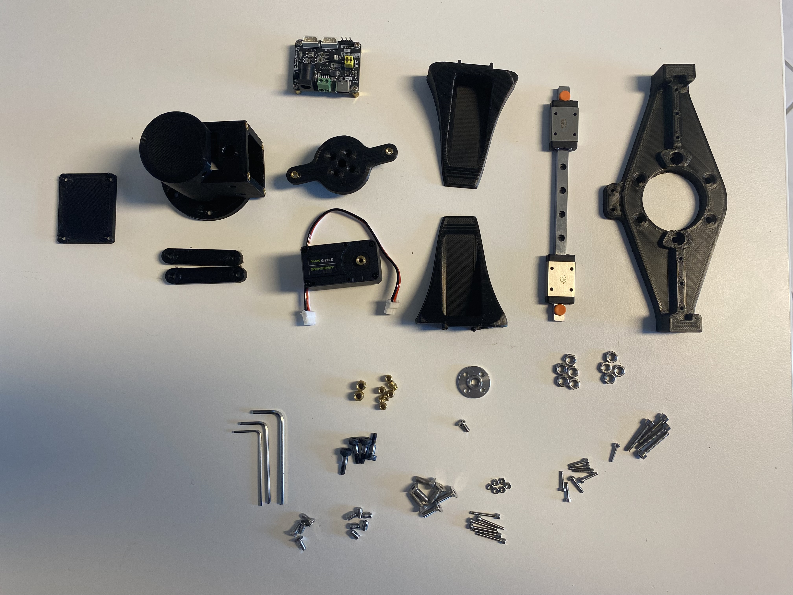
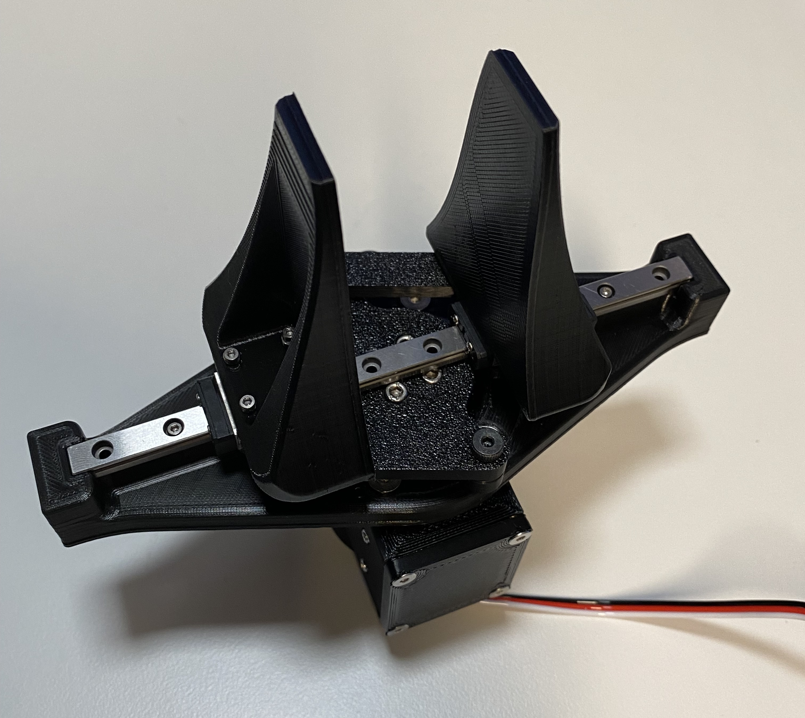

# ST3215 Servo Gripper

## Sprache / Language

- Deutsch: [Zur deutschen Version](#de-start)
- English: [Jump to English version](#en-start)

---

## Deutsch

[Zur Sprachauswahl](#language-selection)

Kompakter, kraftvoller ST3215 Servo Gripper zum Selberbauen mit 3D-Druckteilen, STEP-Modell, detaillierter Montageanleitung und kompletter Materialliste.

### Inhaltsverzeichnis

- [Projekt auf einen Blick](#de-ueberblick)
- [Demovideos](#de-videos)
- [Ordnerstruktur](#de-ordner)
- [Materialliste](#de-bom)
- [3D-Dateien (STL)](#de-stl)
- [CAD-Datei (STEP)](#de-step)
- [Montageanleitung](#de-assembly)
- [Software](#de-software)
- [Druck- und Setup-Hinweise](#de-hinweise)
- [Roadmap](#de-roadmap)
- [Mitwirken](#de-contrib)
- [Changelog](#de-changelog)
- [Lizenz](#de-license)

### Projekt auf einen Blick

| Thema | Details |
|---|---|
| Projekttyp | ST3215 Servo Gripper |
| Mechanik | 3D-gedruckte Baugruppen + Linearfuehrung MGN7H |
| Aktorik | Waveshare ST3215 Serial Bus Servo |
| CAD | STEP-Modell verfuegbar |
| Fertigung | STL-Dateien im Repository |
| Montage | Bebilderte Anleitung mit 25 Schritten |

### Demovideos

- Gesamtansicht: [Overview.mp4](./Video/Overview.mp4)
- Krafttest: [Force.mp4](./Video/Force.mp4)
- Anwendung mit Flasche: [Beer Bottle.mp4](./Video/Beer%20Bottle.mp4)

### Ordnerstruktur

| Ordner | Inhalt |
|---|---|
| [Assembly](./Assembly/) | Schritt-fuer-Schritt-Montage inkl. Bilder |
| [Material](./Material/) | Materialliste mit Mengen, Kosten und Links |
| [Software](./Software/) | Steuerungs-Software (in Entwicklung) |
| [Step](./Step/) | CAD-Datei im STEP-Format |
| [STL](./STL/) | Druckdateien fuer alle Bauteile |
| [Video](./Video/) | Demo- und Funktionstest-Videos |

### Materialliste

- [Material/Readme.md](./Material/Readme.md)

### 3D-Dateien (STL)

- [Baseplate.stl](./STL/Baseplate.stl)
- [Finger_1.stl](./STL/Finger_1.stl)
- [Finger_2.stl](./STL/Finger_2.stl)
- [Motorhousing.stl](./STL/Motorhousing.stl)
- [Motorhousing Cover.stl](./STL/Motorhousing%20Cover.stl)
- [Schwing Arm 1.stl](./STL/Schwing%20Arm%201.stl)
- [Schwing Arm 2.stl](./STL/Schwing%20Arm%202.stl)
- [Turnhead.stl](./STL/Turnhead.stl)

### CAD-Datei (STEP)

- [Gripper.step](./Step/Gripper.step)

### Montageanleitung

- [Assembly/Readme.md](./Assembly/Readme.md)

### Software

> **In Entwicklung** — Geplant sind Python- und IEC 61131-3-Implementierungen.
> In der Zwischenzeit kann die Software des SO-101-Projekts direkt verwendet werden — gleicher Servo, gleicher Treiber.

- [Software/Readme.md](./Software/Readme.md)

### Druck- und Setup-Hinweise

- Gewindeeinsaetze sauber und buendig einschmelzen.
- Bewegliche Baugruppen nach Montage auf Leichtgaengigkeit pruefen.
- Schraubenlaengen bei Toleranzabweichungen fein nacharbeiten.
- Erste Funktionstests ohne Last durchfuehren.

### Roadmap

- [ ] Python-Bibliothek fuer direkte Greifer-Steuerung
- [ ] IEC 61131-3 Funktionsbaustein fuer SPS-Steuerungen
- [ ] Parametrische Varianten fuer unterschiedliche Hubwege
- [ ] Standardisierte Test- und Kalibriersequenz
- [ ] Erweiterte Kompatibilitaet mit weiteren Servo-Treibern

### Mitwirken

Issues und Pull Requests sind willkommen.

### Changelog

Alle Versionen und Änderungen: [CHANGELOG.md](./CHANGELOG.md)

### Lizenz

MIT — siehe [LICENSE](./LICENSE)

[Zur Sprachauswahl](#language-selection)

---

## English

[Back to language selection](#language-selection)

Compact, high-torque ST3215 Servo Gripper with 3D-printed parts, STEP model, detailed assembly guide, and complete bill of materials.

### Table of Contents

- [Project Overview](#en-overview)
- [Demo Videos](#en-videos)
- [Folder Structure](#en-folders)
- [Bill of Materials](#en-bom)
- [3D Files (STL)](#en-stl)
- [CAD File (STEP)](#en-step)
- [Assembly Guide](#en-assembly)
- [Software](#en-software)
- [Print and Setup Notes](#en-notes)
- [Roadmap](#en-roadmap)
- [Contributing](#en-contrib)
- [Changelog](#en-changelog)
- [License](#en-license)

### Project Overview

| Topic | Details |
|---|---|
| Project Type | ST3215 Servo Gripper |
| Mechanics | 3D-printed assemblies + MGN7H linear rail |
| Actuation | Waveshare ST3215 serial bus servo |
| CAD | STEP model available |
| Manufacturing | STL files included |
| Assembly | Illustrated guide with 25 steps |

### Demo Videos

- Full overview: [Overview.mp4](./Video/Overview.mp4)
- Force test: [Force.mp4](./Video/Force.mp4)
- Bottle handling demo: [Beer Bottle.mp4](./Video/Beer%20Bottle.mp4)

### Folder Structure

| Folder | Content |
|---|---|
| [Assembly](./Assembly/) | Step-by-step build guide with images |
| [Material](./Material/) | Bill of materials with quantities and links |
| [Software](./Software/) | Control software (in development) |
| [Step](./Step/) | CAD source file in STEP format |
| [STL](./STL/) | Printable files for all parts |
| [Video](./Video/) | Demo and test videos |

### Bill of Materials

- [Material/Readme.md](./Material/Readme.md)

### 3D Files (STL)

- [Baseplate.stl](./STL/Baseplate.stl)
- [Finger_1.stl](./STL/Finger_1.stl)
- [Finger_2.stl](./STL/Finger_2.stl)
- [Motorhousing.stl](./STL/Motorhousing.stl)
- [Motorhousing Cover.stl](./STL/Motorhousing%20Cover.stl)
- [Schwing Arm 1.stl](./STL/Schwing%20Arm%201.stl)
- [Schwing Arm 2.stl](./STL/Schwing%20Arm%202.stl)
- [Turnhead.stl](./STL/Turnhead.stl)

### CAD File (STEP)

- [Gripper.step](./Step/Gripper.step)

### Assembly Guide

- [Assembly/Readme.md](./Assembly/Readme.md)

### Software

> **Work in progress** — Python and IEC 61131-3 implementations are planned.
> Until then, the SO-101 project software works directly — same servo, same driver.

- [Software/Readme.md](./Software/Readme.md)

### Print and Setup Notes

- Install threaded inserts flush with the surface.
- Verify smooth motion of all moving parts after assembly.
- Adjust screw lengths if tolerances differ between printers.
- Run first functional tests without payload.

### Roadmap

- [ ] Python library for direct gripper control
- [ ] IEC 61131-3 function block for PLC integration
- [ ] Parametric variants for different stroke lengths
- [ ] Standardized calibration and test routine
- [ ] Extended compatibility with additional servo controllers

### Contributing

Issues and pull requests are welcome.

### Changelog

All versions and changes: [CHANGELOG.md](./CHANGELOG.md)

### License

MIT — see [LICENSE](./LICENSE)

[Back to language selection](#language-selection)
